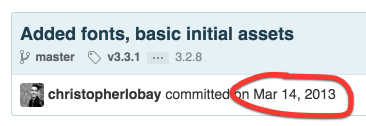
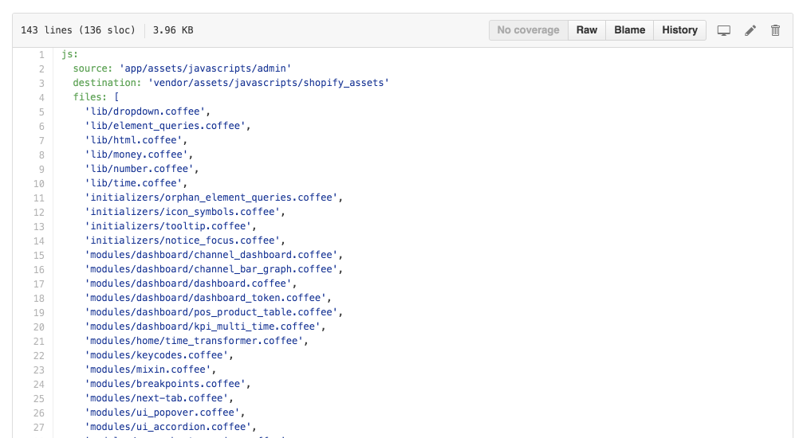

---

# The Assets Gem
## The Shopify experience in every app

---

# The problem
## We've invested so much time and effort into giving the admin a great UI. How do we share this with other apps without repeating ourselves?

---

# Two solutions

1. Move common front end assets to another place, consume it from the admin and other apps
2. Copy common assets from the admin to another place to share with apps

---

# Two solutions

1. _Move_ common front end assets to another place, consume it from the admin and other apps
2. _Copy_ common assets from the admin to another place to share with apps

---

# We have a lot of apps now!

- channels: Facebook, Twitter, Pinterest, Buy Button, Amazon, Facebook Messenger
- embedded apps: Digital downloads, Wholesale, Barcode printer, Shopify Scripts, Bulk Discounts
- integrations: Accounting, UberRUSH, Avalara
- experiments: React Reports

Github search: `shopify_assets user:shopify filename:Gemfile`

^we want all of these to have a good UI

---

# Move

Relocating the most global and shared assets to a common dependency of all apps that need the admin styles: fonts, layout, the grid, forms, etc.

- Central location for all assets, no duplication
- Slows down development of the admin: developers need to make changes in a different repository and then update the dependency in the admin

---

# Copy

Copy assets to a different repository as external apps need them

- Doesn't affect admin development
- Slows down development of apps: something broken in the admin needs to be fixed there then propogated to apps via dependency
- Forget backwards compatibility

^Ultimately we went with this solution

^ADMIN IS CORE PART OF BUSINESS

---

# Some history

^I joined a few months after this and started to work on the brochure, where becuz jekyll those assets were copied again to the brochure repository

---

# V1

- beloved `admin2` assets
- also contained assets used on brand sites

^process very manual, slow, wasn't used very much
^brand assets got moved to another repo
^didn't touch it much

---

# Then came Facebook and Buy Button

^the gem was abandoned and out of date so we were manually cping things into each project from the admin
^redo!

---

# V2

- Automate the process as much as possible
- Make UI Components work in apps
- Reduce the amount of assets included in each app's application bundle

---

# The process

1. We maintain a whitelist of files we want out of the admin.
2. We copy these files into the gem
3. Release a new version
4. Update in consuming apps
5. Rinse
6. Repeat

^whitelist: in an effort to keep the amount of CSS and JS in each project small.

---

^files are copied AS IS

---

# What's included

- UI Components
- Core CSS and Javascript
- SVGs
- Dependencies like Twine, Turbograft, Lodash, jQuery. Anything we need to replicate the Shopify UI

---

# What's not included

- Area-specific CSS and JS
- old Data URI icons

^important to keep area-specific code out of directories like global and layout

---

# A note about versions

We're using this weird format for versions in the gem:

    9.2.1.shopify-41a4fd1735d4fc7378fe463cb527598dc0d60869

^SEMVER

---

# Getting set up

1. Include the assets gem in your `Gemfile`

        gem 'shopify_assets',
          git: 'https://shopify-dep:<key>@github.com/Shopify/assets'
          tag: '9.2.1.shopify-41a4fd1735d4fc7378fe463cb527598dc0d60869'

---

2. Import the base styles into your `application.scss`:

        @import 'shopify_assets/assets-base';

3. Include some JS to help you use Shopify JS outside the admin:

        #= require shopify_assets/channel

        window.channel = new Channel.app()
        channel.init()
        channel.initTurboGraft()

^see the project README for more info on some of the JS

---

# Using admin styles

Import stylesheets as necessary:

    @import 'shopify_assets/modules/ui-banner';
    @import 'shopify_assets/modules/next-headings.scss';

---

Use UI components in your views!

    <%= ui_banner(status: 'error') do |banner| %>
      <% banner.title 'My cool banner' %>
      <% banner.content do %>
        
Cool banner content.

      <% end %>
    <% end %>

---

# Problems

- No Backwards compatibility. Updating the gem in your project could break _anything_.
- Not many tests. We ensure that the assets we bring in compile, but we're not copying over any of the unit tests from admin.
- Some components that depend on pieces of shopify don't work yet.

^If anyone has any ideas about how to solve these, please contact me or come to the #assets-gem Slack channel

---

# Contributions welcome!

---

# Keeping up with the assets gem

Visit us in #assets-gem
Keep up with new versions on the github releases page: http://github.com/shopify/assets/releases

Questions?
